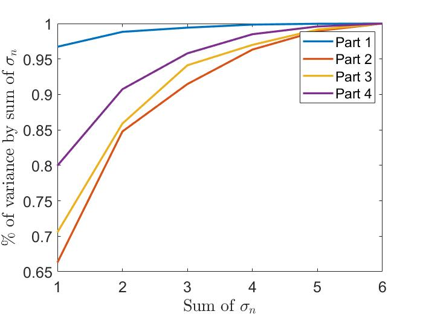
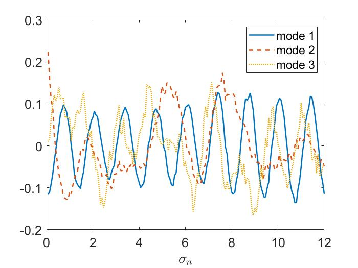

# Image Tracking and Principal Component Analysis of Redundant Video
This project analyzes noisy video of an oscillating paint can in order to expose the usage and capabilities of PCA.

# Motivation
This project was completed for a graduate level course in Scientific Computing at the University of Washington's Applied Mathematics department.

# Framework
MATLAB - 2019

# Figure Examples
These figures show variance of the singular values across data, from very little noise (Part 1) to very very noisy, with rotation, lateral movement, and camera shake in Part 4. The figure on the right shows Part 4's Principal Modes, which reveal the oscillation in the principal mode directions.

